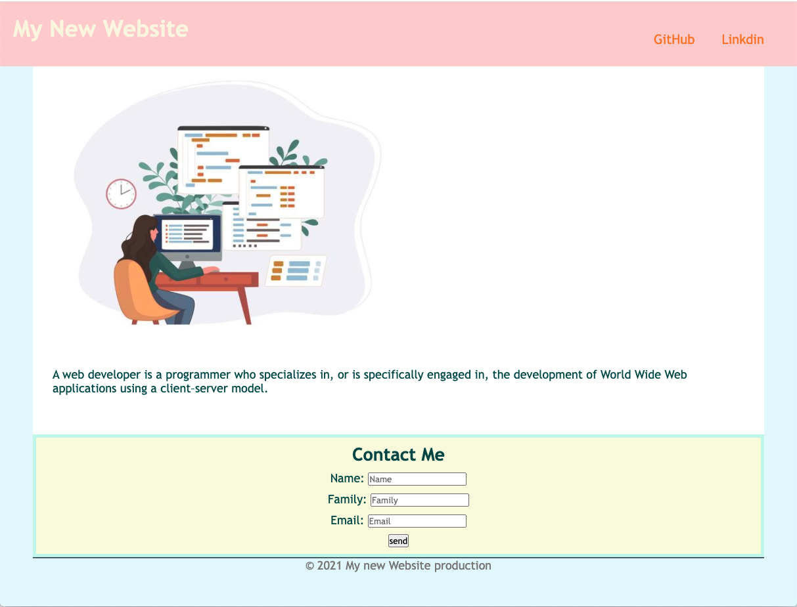

# <Landing-page>

# Landing page

## Summery 
This landing page is my very first project. 

This single webpage have a image with a caption, header and footer, collects a visitor's contact information ,also a contact form with polished and accessible UI.

## Built with

Refer to the documentation:

* [MDN Web Docs on HTML elements](https://developer.mozilla.org/en-US/docs/Web/HTML/Element)

* [MDN Web Docs on color](https://developer.mozilla.org/en-US/docs/Web/CSS/color)

* [MDN Web Docs on font](https://developer.mozilla.org/en-US/docs/Web/CSS/font)

* [MDN Web Docs on HTML section heading elements](https://developer.mozilla.org/en-US/docs/Web/HTML/Element/Heading_Elements)

* [MDN Web Docs on how to structure a web form](https://developer.mozilla.org/en-US/docs/Learn/Forms/How_to_structure_a_web_form)

* [MDN Web Docs on the button element](https://developer.mozilla.org/en-US/docs/Web/HTML/Element/button)

* [MDN Web Docs on the figure element](https://developer.mozilla.org/en-US/docs/Web/HTML/Element/figure)

## Link
 [Click here to access to the page](https://hadisparsa.github.io/hadis-first-landing-page/).

## Mock-Up
The following images show the web application's appearance:

